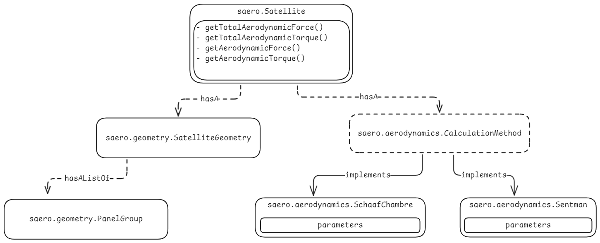
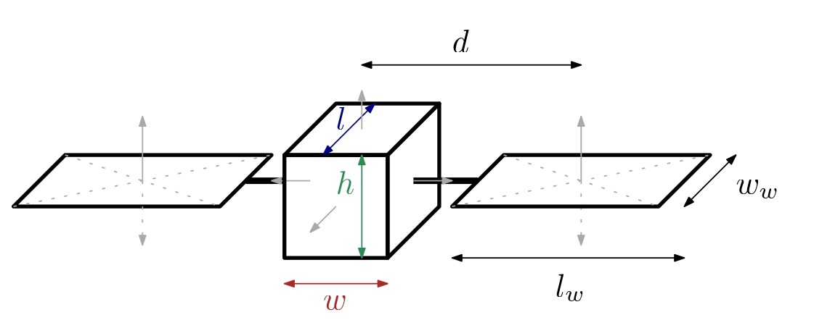

# Symbolic Satellite Aerodynamics Toolbox
This toolbox aims to simplify the process quickly obtaining aerodynamic models for satellites with simple geometries using panel methods while allowing the user to define all possible variables as Matlab symbolic expressions.
The toolbox can calculate forces and torques of a user defined geometry using different aerodynamic models for Free Molecular Flow (e.g. Sentman).

This toolbox not only evaluates forces numerically for given inputs, but actually allows the user to obtain analytical aerodynamic models (e.g. calculation of forces) as Matlab Function handles.

### What you can do
Using symbolic variables allows for workflows such as:
- Defining a satellite bus with a symbolic length `l`
- Defining a satellite with rotatable panel geometries by defining rotation angles as symbolic variables
- Obtaining the torque of a satellite with symbolic variables as a matlab Function handle

### What this toolbox is CAN NOT DO
- Computing wether a panel is shadowed by other panels
- High fidelity computations

## Requirements
- Install the [Matlab symbolic toolbox](https://de.mathworks.com/products/symbolic.html)

## Install
Open the terminal and run:
```bash
git submodule update --init --recursive
```

## Add to path
You can either make sure the `+saero` folder in available on the Matlab path or simply run
```matlab
openProject('.')
```
in the root project folder. 

Alternatively double click the `Symbolicvleoaerodynamics.prj` file to setup the project with correct path dependencies.

----------------------------

## Coordinate Systems
All coordinates are defined in the body reference frame. All normal vectors are assumed to be unit vectors. The `B`-frame is defined as a right hand system.

## Usage

### Satellite Geometries
Each satellite has a `SatelliteGeometry` which consists of (potentially several) `PanelGroup` objects.

As a user you need to build your satellites geometry by defining these panel groups.

### Panel group
You can simply use predefined shapes like

```matlab
l = 2;
w = 1;
h = 1;
center_of_mass = [0;0;0];
body = saero.geometry.shapes.Box(l, w, h, center_of_mass);
```

Alternatively you can simply manually define a satellite geometry by providing panel normals, positions of each panels center of pressure and panel areas:

```
% Panel normals (unit vectors)
normals = [  1,-1, 0, 0, 0, 0;
             0, 0, 1, 0,-1, 0;
             0, 0, 0,-1, 0, 1];

% Panel areas
areas = [h*w, h*w, h*l, w*l, h*l, w*l];

% Center-of-pressure positions (midpoint of each panel)
cop_pos = - center_of_mass + ...
            [l/2, -l/2,  0,    0,   0,      0;
            0,   0,     w/2,  0,   -w/2,   0;
            0,   0,     0,    -h/2,   0,     h/2];

myBox = saero.geometry.PanelGroup(cop_pos, normals, areas);
```

### Geometry
then you can simply define the geometry with
```matlab
satellite_geometry = saero.geometry.SatelliteGeometry([body])
```

## Calculation Methods
Each satellite has a calculation method to obtain aerodynamic forces (and torques).

Currently available:
- Sentman's method [1]
- Schaaf-Chambre [2]

The calculation method is initialized via
```matlab
sentman = saero.aerodynamics.Sentman();
```
where by default, a set of parameters is defined. Parameters can be optionally varied using the syntax
```matlab
sentman = saero.aerodynamics.Sentman( ...
    "alpha_E", 0.95, ...
    "rho", 1e-11);
```
where all other model parameters are kept at the default value.


## Defining the satellite
Each satellite is an instance of the class `saero.Satellite`. The following class diagram shows the hierarchy:



## Full example
We will derive the aerodynamic model symbolically for the following satellite geometry with a variable size bus and two solar panels:



## References

1. H. Sentman, “FREE MOLECULE FLOW THEORY AND ITS APPLICATION TO THE DETERMINATION OF AERODYNAMIC FORCES”.
2. S. A. Schaaf and P. L. Chambre, Flow of Rarefied Gases. Princeton University Press, 1958.
